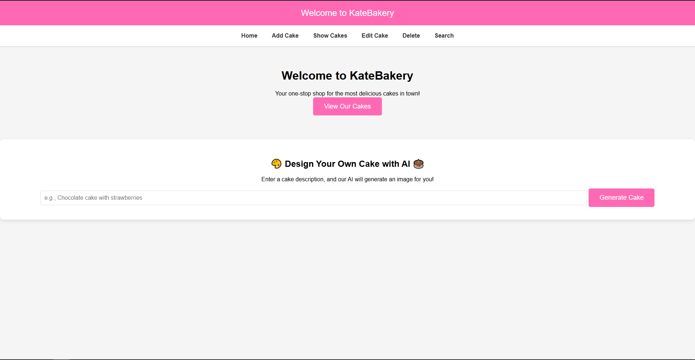
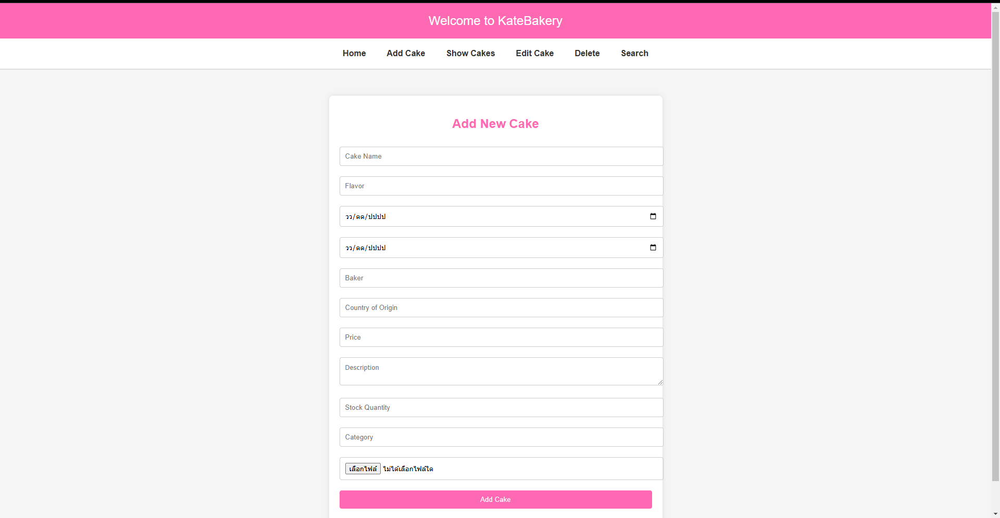
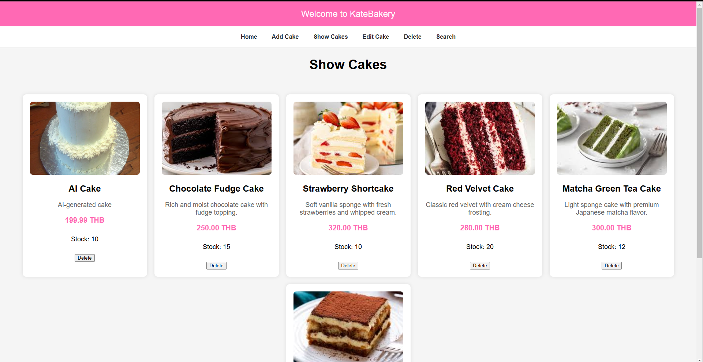
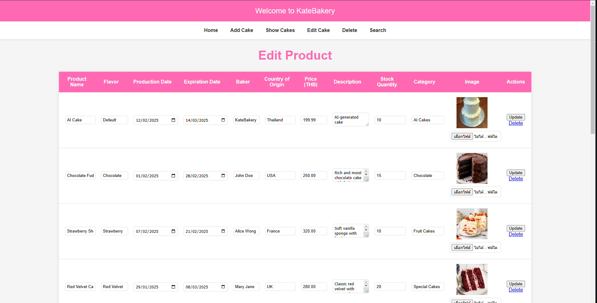
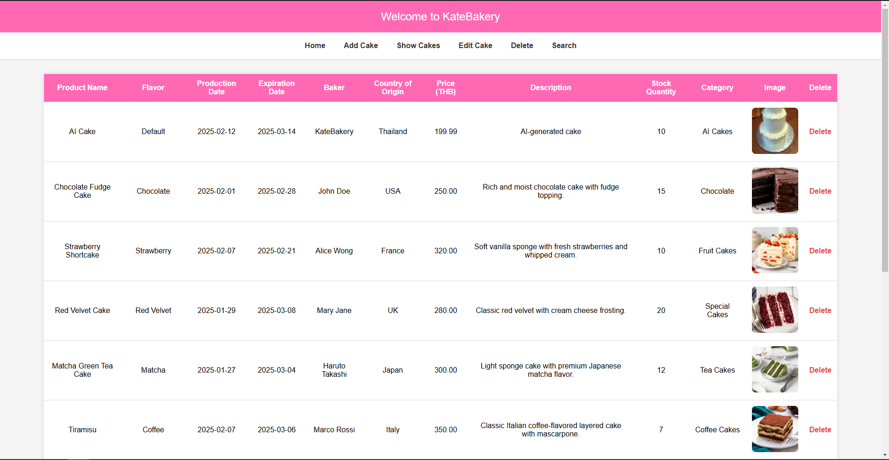
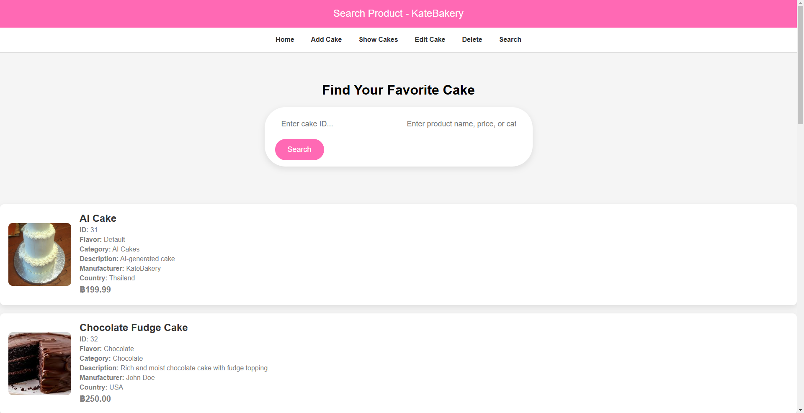

🍰 InventoryWeb-API-DEEPAI

InventoryWeb-API-DEEPAI is a smart inventory management system designed for bakeries, integrating AI-generated images through the DeepAI API and providing a seamless CRUD (Create, Read, Update, Delete) experience for product management.

✨ Key Features

🎨 AI-Generated Cake Images - Automatically generate cake images using DeepAI.

📦 Complete Inventory Management - Add, edit, delete, and display bakery products.

🔎 Advanced Search - Easily find products through the API.

📤 Image Upload Support - Store and retrieve product images efficiently.

⚡ Database Integration - Manage products with MySQL.

🌐 RESTful API - Ensures smooth backend communication.

📂 Project Structure

/InventoryWeb-API-DEEPAI  
│── api/  
│   ├── add_cake.php           # Add a new cake entry  
│   ├── add_product.php        # Add a new product  
│   ├── delete_product.php     # Remove a product  
│   ├── edit_product.php       # Update product details  
│   ├── generate_cake.php      # Generate cake images using AI  
│   ├── search_product.php     # Search for products  
│   ├── show_cakes.php         # Display all available cakes  
│   ├── submit_product.php     # Submit new product details  
│── assets/  
│   ├── cake_image/            # Stores AI-generated cake images  
│   ├── uploads/               # Stores user-uploaded images  
│── backend/  
│   ├── connect.php            # Database connection file  
│── frontend/  
│   ├── home.php               # Main frontend for product display  
│── README.md  

## 🎨 WEB Preview

🚀 Installation Guide

1️⃣ Clone the repository

-git clone https://github.com/yourusername/InventoryWeb-API-DEEPAI.git 
-cd InventoryWeb-API-DEEPAI

2️⃣ Set Up Database

-Create a MySQL database.

-Update connect.php with your database credentials:

-define('DB_HOST', 'localhost');
-define('DB_USER', 'root');
-define('DB_PASS', '');
-define('DB_NAME', 'inventory_db');

3️⃣ Configure DeepAI API Key

-Sign up at DeepAI to get an API key.

-Add the API key to .env or define it in generate_cake.php:

-define('DEEPAI_API_KEY', 'your_api_key_here');

4️⃣ Start the Server

-Run the local PHP server:

-php -S localhost:8000

🖼 AI Image Generation
-DeepAI is used to generate product images dynamically.
Example usage:

$ch = curl_init(); 
curl_setopt($ch, CURLOPT_URL, "https://api.deepai.org/api/text2img"); 
curl_setopt($ch, CURLOPT_POST, 1); 
curl_setopt($ch, CURLOPT_POSTFIELDS, ['text' => "chocolate cake"]); 
curl_setopt($ch, CURLOPT_HTTPHEADER, ['api-key: your_api_key_here']); 
curl_setopt($ch, CURLOPT_RETURNTRANSFER, true); 
$response = curl_exec($ch); 
curl_close($ch); 
